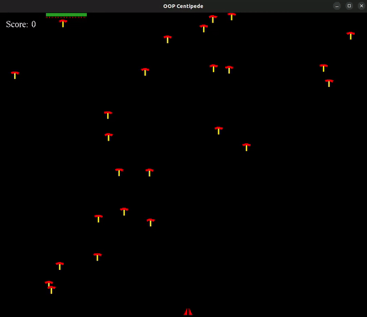

+++
title = "Running an OpenGL game with WebAssembly"
date = 2024-09-21
[taxonomies]
tags=["wasm"]
+++

<style>
main img {
    display: block;
    margin-left: auto;
    margin-right: auto;
}
</style>

# What even is WebAssembly?

WebAssembly introduces huge implications for what's possible on the web platform, it's a binary instruction format optimized for fast execution, allowing code written in languages like C, C++, and Rust to run with near-native speed in the browser. By operating as a low-level virtual machine, WebAssembly executes tasks in a manner similar to how native applications do, but within the web's security sandbox. This makes it possible to run performance intensive applications, such as video games, computer vision, virtual and augmented reality, and realtime data intensive visualizations, directly in the browser. Each of the major browsers have their own wasm runtime to support these kind of applications.

# Why should you care?

Beyond just the browser environment, WebAssembly opens up a wide range of applications including microservices, serverless, 3rd party plugin systems, databases, analytics, and event streaming, among others. Its lower start-up time than other similar technologies, such as JS isolates and containers along with being sandboxed-by-default and also the fact that it runs at near native speed are some of the reasons for a wide range of use cases. If you have previous experience getting bottlenecked by JavaScript's performance in browsers, WebAssembly is a welcome addition to the web ecosystem. I have had my MacBook Pro give up when working with data intensive visualizations in [DataDog](https://www.datadoghq.com/) or when playing with Shaders in [ShaderToy](https://www.shadertoy.com/). I've also read about how JavaScript was like pre JIT compilation but back then it was the only option if you wanted to run code in browser to interact with the web page. You can think of WebAssembly as a new programming language which is much faster than JavaScript and can run in browsers as well. This does not mean that WebAssembly is intended to replace JavaScript, it's designed to work alongside JS which makes it possible to combine WebAssembly’s speed with JavaScript's flexibility. Most of the adoptions which we will see will not be full WebAssembly codebases, but both JS and WebAssmbly being used in a single application complementing each other. If interested, you can read about these use cases in detail, [here](https://bytecodealliance.org/articles/wasmtime-1-0-fast-safe-and-production-ready?ref=abdullahxz.github.io).

# Getting Hands Dirty

I've been looking at WebAssembly for years now (wrote one hello world program years ago) and only very recently decided to dive deeper with an interesting enough project to fuel my weekends. Centipede is a vertically oriented fixed shooter arcade game produced by Atari, Inc. in June 1981. The game was designed by Dona Bailey and Ed Logg. The player fights off centipedes, spiders, scorpions, and ants, completing a round after eliminating the centipede that winds down the playing field. It was one of our semester projects in university and just the right fit for this project.



## Compiler toolchain

We'll be using Emscripten to compile the centipede program into WebAssembly. It's an open source compiler toolchain using `emcc` as a frontend and `Clang` and `LLVM` as backend. Besides that, Emscripten can also generate the "glue" JavaScript and HTML code which comes in handy especially in an experimental project like this one. This is needed to handle memory allocation, memory leaks, and a host of other problems such as for now, WebAssembly cannot currently directly access the DOM, it can only call JavaScript, passing in integer and floating point primitive data types. Thus, to access any Web API, WebAssembly needs to call out to JavaScript, which then makes the Web API call.


Once the HTML & JS code and WASM modules are ready we can use any http server to serve them. Just like HTML and JS, browser downloads the wasm module. Then, it can make the short hop from WebAssembly to that target machine’s assembly code (x86 or ARM).

Before we go forward with the port there are some things we need to take care of such as to modify file handling to adapt to the limitations of the browser/JavaScript. The support for legacy OpenGL features and commands is also not great so going into this I was not expecting a flawless 1:1 port. I expected to make significant modifications to my program to address these limitations. However, as we’ll see during the porting process, the adjustments required are minimal. In fact, the only changes I needed to make involved commenting out or swapping a few unsupported OpenGL functions in Emscripten.

## Okay, Here it Goes

For the port itself, all that is needed is using `em++` as a drop in replacement for `g++`. There are also a handful of linker flags which are needed to enable support for legacy GL features and other performance optimizations, some of them being

- LEGACY_GL_EMULATION
    - Enables legacy GL support.
- GL_UNSAFE_OPTS
    - Enables some potentially-unsafe optimizations in GL emulation code by attempting to skip redundant GL work and cleanup. It is enabled by default but we set this to false.
- STACK_SIZE
    - The total stack size. There is no way to enlarge the stack, so this value must be large enough for the program’s requirements. Setting this to a lower value than your program needs will cause it to crash.
- EXIT_RUNTIME
    - By default Emscripten does not include code to shut down the runtime. Building with EXIT_RUNTIME will include the code to do so.
- -o game.html
    - Specifies that we want Emscripten to generate an HTML page to run our code in and the filename to use, as well as the Wasm module and the JavaScript glue code to compile and instantiate the Wasm so it can be used in the web environment.

### Legacy Leagacy Legacy

The first time I ran the project in web turned out to be a bit of let-down. There were no mushrooms on the screen and the browser's console was overflowing with errors.


The faulty code was the following Torus2d function which was being used to draw the Mushroom's hat.

```cpp
void Torus2d(int x, int y,
	float angle,
	float length,
	float radius,
	float width,
	unsigned int samples,
	float *color) {
	angle = Deg2Rad(angle);
	length = Deg2Rad(length);
	if (color) {
		glColor3fv(color);
	}
	if (samples < 3)
		samples = 3;
	const float outer = radius + width;
	glBegin(GL_QUAD_STRIP);
	for (unsigned int i = 0; i <= samples; ++i) {
		float a = angle + (i / (float)samples) * length;
		glVertex2f(x + radius * cos(a), y + radius * sin(a));
		glVertex2f(x + outer * cos(a), y + outer * sin(a));
	}
	glEnd();
}
```

Upon looking into this, turns out `GL_QUAD_STRIP` was the issue as it would just not run in browser. This made sense to me because I knew QUADS were no longer a primitive in OpenGL as they were deprecated in [OpenGL 3.0](https://www.khronos.org/opengl/wiki/primitive#Quads) so I swapped it with the next closest thing, a `GL_TRIANGLE_STRIP` primitive, which appears to be working well.


If you notice closely, the score is also not getting displyed in the browser environment. Following is the C++ code to draw a string on the canvas

```cpp
void DrawString(float x, float y, const string& score, float * color) {
	glPushMatrix();
	glLoadIdentity();
	glDisable(GL_TEXTURE_2D);
	glBindTexture(GL_TEXTURE_2D, 0);
	GLvoid *font_style = GLUT_BITMAP_TIMES_ROMAN_24;
	
    if (color)
		glColor3fv(color);
	glRasterPos3f(x, y, 1);
	for (int i = 0; i < score.size(); i++)
		glutBitmapCharacter(font_style, score[i]);
	glPopMatrix();
}
```

The issue with this approach to draw on canvas is that it uses a lot from the deprecated fixed function pipeline of OpenGL and porting it to modern OpenGL requires extra effort which I believe is for some other weekend, maybe next. So for now I can live without seeing my single digit score on the corner of my screen.

### It's a Feature

Now all that remains is when the player collides with in game objects like centipede, spider or fleas the game is over and is supposed to exit, but it does not in this case. Earlier I mentioned EXIT_RUNTIME linker flag which is used to include code to exit the runtime. By default Emscripten does not include code to shut down the runtime. This means that when main() exits, it does not flush the stdio streams, or call the destructors of global C++ objects, or call atexit callbacks. This lets it emit smaller code by default, and is normally what you want on the web: even though main() exited, you may have something asynchronous happening later that you want to execute. Even when building with EXIT_RUNTIME it did not exit the runtime and asked to use `emscripten_force_exit` if we want to force a true shutdown. I, for once, did not want to call JavaScript from my C++ code so I skipped this. Now, when the player dies, it does not exit the runtime; essentially giving the player unlimited lives.

There you have it, a C++ program running on web!


# Fin.

This small project provided an excellent opportunity to refresh my understanding of WebAssembly. The technology continues to advance, with its feature set expanding to include multithreading, relaxed SIMD support, garbage collection, improved debugging infrastructure, and 64-bit addressing, among other improvements. A set of proposals could be found [here](https://github.com/WebAssembly/proposals). I'd also like to credit Lin Clark whose work was an invaluable resource during this weekend project, she does an awesome job with [code cartoons](https://www.code-cartoons.com/). WebAssembly bridges the gap between native and web environments, creating new possibilities for performance-intensive, secure and scalable applications both inside and outside the browser. As the ecosystem matures, the opportunities for developers will only grow, making this a fascinating space to watch and experiment with.

You can find the code, [here](https://github.com/Abdullahxz/centipede-webassembly). I also made some last minute changes so the game would look more like this when you run it.


# Sources
- [Mozilla Docs](https://developer.mozilla.org/en-US/docs/WebAssembly/Concepts)
- [Mozilla Blogs](https://hacks.mozilla.org/category/javascript/)
- [Bytecode Alliance](https://bytecodealliance.org/)
- [Lin Clark](https://leaddev.com/community/lin-clark)
- [Emscripten](https://emscripten.org/docs/introducing_emscripten/about_emscripten.html)
